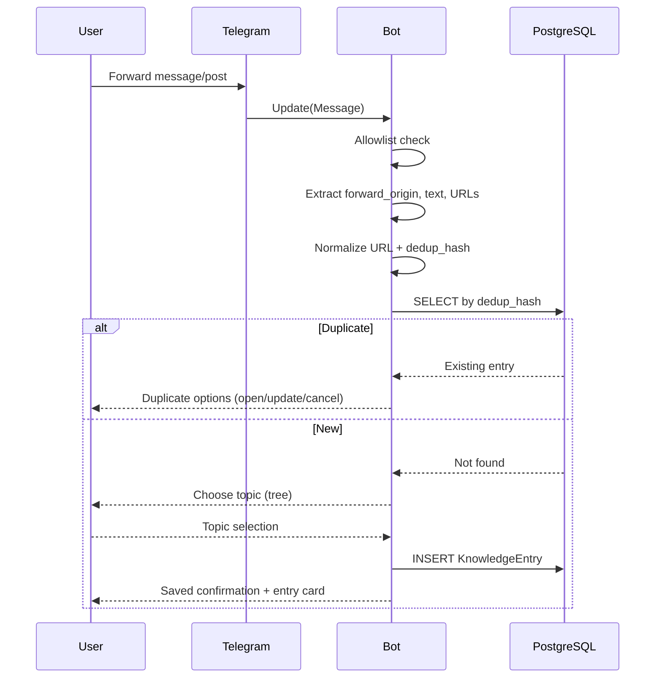
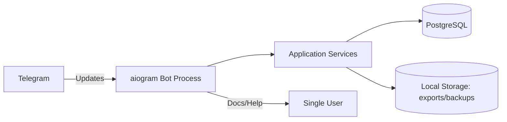

> ⚠️ **ARCHIVE — Do not use as source of truth.**
> This is the original monolithic TZ document (Phase 1). Authoritative specs are in:
> - `LAYER-2/specs/requirements.md`, `architecture.md`, `domain-model.md`, `behaviors.md`

# Developer-Ready Specification and Implementation Artifacts for a Single-User Telegram Knowledge-Base Bot

## A. Technical Specification

### Executive summary
This report specifies an MVP-grade, developer-ready system for a **single-user Telegram personal knowledge base**: one bot in a **1:1 chat**, backed by a **database**, optimized for saving and retrieving AI-focused resources (links, forwarded posts, notes) while supporting **dynamic hierarchical topics** editable at runtime (no code changes required). The design prioritizes: (1) robust capture from forwarded Telegram messages using official Bot API metadata (notably `forward_origin`), (2) strong deduplication via deterministic URL normalization + content fingerprints, (3) fast search using PostgreSQL full-text search and trigram similarity, and (4) operational safety for a personal bot (single-user allowlist, backups, restores, and auditability). fileciteturn0file0

### Scope and fixed constraints
The system is constrained to: **one Telegram bot**, **personal 1:1 chat**, **single human user**, **DB-backed persistence** (no multi-user roles), used to store posts, forwarded messages, links, and references for retrieval later. fileciteturn0file0

The topic model is a **dynamic tree** (not an enum) supporting nested subject areas such as “AI → LLMs → Prompt Engineering” and extendable without code changes. fileciteturn0file0

Initial required top-level topics are seeded as:
- Java
- Git
- Neural Networks / AI
- Infrastructure
- Useful Channels
- Learning fileciteturn0file0

### Implementation stack (MVP defaults)
Chosen stack is pragmatic, widely supported, and aligns with Telegram + async I/O:
- **Python 3.12+**
- **aiogram v3** for Telegram long-polling and guided flows (FSM) citeturn2search3turn2search15turn2search31  
- **PostgreSQL 16+** as primary datastore (full-text search, `pg_trgm`, `ltree`) citeturn0search3turn1search3turn0search2  
- **SQLAlchemy 2.x (async)** for persistence layer citeturn2search1turn2search5  
- **Alembic** for migrations citeturn2search2turn2search6  
- Optional HTTP admin surface: **FastAPI** only if you want a local admin/health endpoint (not required for MVP bot-only operation). If used, lifecycle hooks should be implemented using FastAPI’s lifespan pattern. citeturn2search0

Rationale: Telegram Bot API supports two mutually exclusive update delivery modes (long polling via `getUpdates` or webhooks), and long polling is explicitly suited for environments without a dedicated public endpoint. citeturn3view0turn2search3

### Core system behaviors
#### Capture from Telegram
Messages forwarded to the bot are saved as KnowledgeEntries. Telegram’s `Message` object contains:
- `forward_origin` for forwarded message origin metadata, enabling stable attribution to a channel/chat and its original timestamp. citeturn4view0turn14view1
- `has_protected_content` (message cannot be forwarded) which impacts how much origin information can be preserved or whether the bot can later “forward” vs “copy” content. citeturn4view0turn4view1

Updates retention: Telegram stores incoming updates until the bot receives them, but not longer than 24 hours, underscoring the importance of continuous polling uptime for reliability. citeturn3view0

#### Search
Search is implemented on PostgreSQL:
- Full-text search using `to_tsvector(...) @@ to_tsquery(...)` with a GIN index for speed. citeturn0search3turn0search11
- Fuzzy similarity for “related items” using `pg_trgm` operators/functions with GIN/GiST support. citeturn1search3turn5search22
- Topic-descendant filtering using `ltree` path operators and indexing. citeturn0search2turn5search6

#### Deduplication
Deduplication is deterministic and stable:
- Primary dedup key: normalized URL (canonicalization guided by URI/URL standards) + SHA-256 hash. citeturn6search0turn6search1
- Secondary dedup key (no URL): Telegram origin fingerprint (origin chat + origin message_id when available) derived from `forward_origin`. citeturn14view1turn4view0

#### Import / export / backups
- Import via bot document upload uses Telegram `getFile` and file download link flow; official docs specify a practical Bot API download limit and link validity window. citeturn4view3
- Backups use `pg_dump` in `-Fc` custom format for flexible restores via `pg_restore`. citeturn5search0turn5search7

#### Operational safety (single-user)
- Hard allowlist by Telegram user id (only one user can invoke any functionality).
- Rate limiting: bot must avoid sending >1 message/sec in a single chat to prevent 429 errors. citeturn1search2

---

## B. Functional Requirements

- FR-001 The system SHALL operate as a single Telegram bot in a single personal 1:1 chat (no groups/channels/forums/multi-user roles). fileciteturn0file0  
- FR-002 The system SHALL persist all data in a database-backed store. fileciteturn0file0  
- FR-003 The system SHALL enforce a single-user allowlist (only one Telegram user id may use the bot).  
- FR-004 The system SHALL support creating entries manually through bot commands and guided flows. fileciteturn0file0  
- FR-005 The system SHALL support saving entries by forwarding Telegram messages/posts to the bot and extracting origin metadata from `forward_origin` when available. citeturn4view0turn14view1  
- FR-006 The system SHALL support importing entries from external file/table formats (MVP: CSV and JSON; optional: Markdown). fileciteturn0file0  
- FR-007 The system SHALL store, at minimum, the KnowledgeEntry mandatory fields exactly as listed in the requester constraints. fileciteturn0file0  
- FR-008 The system SHALL maintain a dynamic hierarchical Topic tree (create, rename, move, archive nodes) without code changes. fileciteturn0file0  
- FR-009 The system SHALL seed the initial top-level Topics: Java, Git, Neural Networks / AI, Infrastructure, Useful Channels, Learning. fileciteturn0file0  

Search and retrieval:
- FR-010 The system SHALL support keyword search across title/description/notes and extracted message text using PostgreSQL full-text search. citeturn0search3  
- FR-011 The system SHALL support tag-based search and tag filters. fileciteturn0file0  
- FR-012 The system SHALL filter by a Topic and include all descendants when requested (topic subtree filtering). fileciteturn0file0  
- FR-013 The system SHALL provide curated selections (“Saved Views / Smart Collections”) that persist a filter snapshot and can be re-run. fileciteturn0file0  
- FR-014 The system SHALL provide “related materials” suggestions using deterministic similarity (shared topic/tags + trigram/FTS ranking). citeturn1search3turn5search22  

Workflow and organization:
- FR-015 The system SHALL allow editing entry metadata (title, description, topic, status, tags, notes). fileciteturn0file0  
- FR-016 The system SHALL model statuses using exactly: New, To Read, Important, Archive, Verified, Outdated. fileciteturn0file0  
- FR-017 The system SHALL enforce status semantics and allowed transitions as defined in section G. fileciteturn0file0  
- FR-018 The system SHALL prevent duplicates by URL normalization + dedup hash and block or merge duplicates per configured policy. fileciteturn0file0  

Portability and ops:
- FR-019 The system SHALL export entries and related entities (Topics, Tags, Sources, Saved Views) to at least JSON and CSV. fileciteturn0file0  
- FR-020 The system SHALL create backups and record them in BackupRecord, including checksum and restore_tested_at when tested. fileciteturn0file0  
- FR-021 The system SHALL restore from backups with safety rails (confirmation token / restricted mode). fileciteturn0file0  
- FR-022 The system SHALL record ImportJob and ExportJob runs and their counts and status fields. fileciteturn0file0  
- FR-023 The system SHALL provide personal statistics (saved count, by topic, by status, by source, duplicates prevented). fileciteturn0file0  

---

## C. Non-Functional Requirements

- NFR-001 The bot SHALL respond to interactive commands within 2 seconds for typical operations (non-search), excluding long import/export jobs.  
- NFR-002 The system SHALL support full-text search with an indexed strategy (GIN) to avoid full table scans for typical queries. citeturn0search11turn0search3  
- NFR-003 The system SHALL support fuzzy related-item lookups using `pg_trgm` with appropriate indexes. citeturn1search3turn5search22  
- NFR-004 The system SHALL be deployable as a single service using long polling (no public webhook endpoint required for MVP). citeturn3view0turn2search3  
- NFR-005 The system SHALL implement Telegram send-rate limiting to avoid 429 errors (<= 1 msg/sec in the private chat). citeturn1search2  
- NFR-006 The system SHALL use migration tooling (Alembic) for schema evolution. citeturn2search2turn2search6  
- NFR-007 The system SHALL be resilient to process restarts and safely resume polling without data corruption (idempotent handlers, transactional writes).  
- NFR-008 The system SHALL not store Telegram bot tokens or secrets in source control (environment variables only).  
- NFR-009 The system SHALL restrict all bot actions to the allowlisted user id; unauthorized users SHALL receive no sensitive data.  
- NFR-010 The system SHALL log structured events (JSON) for: message ingests, dedup decisions, imports/exports, backups/restores, and errors.  
- NFR-011 The system SHALL provide reproducible backups using `pg_dump` custom format and restorable using `pg_restore`. citeturn5search0turn5search7  
- NFR-012 Database operations SHALL use prepared queries/ORM bindings to prevent injection.  
- NFR-013 The design SHALL keep topic hierarchy consistent (no cycles; stable id references even after rename/move).  
- NFR-014 The system SHALL be testable with unit tests for URL normalization/dedup and integration tests for DB + key bot flows.  
- NFR-015 The bot SHALL degrade gracefully when forwarded messages lack origin metadata or have `has_protected_content`. citeturn4view0turn4view1  

---

## D. Domain Model

### KnowledgeEntry
Purpose: canonical record representing one saved resource (URL, forwarded post, note) with searchable metadata and workflow state. fileciteturn0file0

| Field | Type | Null | Default | Constraints / Notes |
|---|---:|---:|---:|---|
| id | UUID | NO | gen_random_uuid() | PK |
| original_url | TEXT | YES | NULL | Raw URL as received (may be absent for pure Telegram note) |
| normalized_url | TEXT | YES | NULL | Result of normalization rules (section G) |
| telegram_message_link | TEXT | YES | NULL | Best-effort `t.me/...` link when derivable |
| title | TEXT | NO | `''` | Set by user or auto-derived from URL/message |
| description | TEXT | YES | NULL | Summary or extracted snippet |
| source_id | UUID | YES | NULL | FK → Source.id |
| source_name | TEXT | NO | `''` | Denormalized snapshot (channel/name/domain) fileciteturn0file0 |
| source_type | TEXT | NO | `''` | Enum-like string for Source kind (e.g., `telegram_channel`, `web`, `person`) fileciteturn0file0 |
| message_date | TIMESTAMPTZ | YES | NULL | Original message time (prefer `forward_origin.date`) citeturn14view1 |
| saved_date | TIMESTAMPTZ | NO | now() | When user saved it |
| primary_topic_id | UUID | NO | — | FK → Topic.id fileciteturn0file0 |
| status_id | UUID | NO | — | FK → Status.id fileciteturn0file0 |
| notes | TEXT | YES | NULL | Freeform notes |
| dedup_hash | TEXT | NO | — | Unique; SHA-256 hex |
| created_at | TIMESTAMPTZ | NO | now() | |
| updated_at | TIMESTAMPTZ | NO | now() | updated via trigger |

Indexes:
- Unique on `dedup_hash`
- B-tree on `saved_date`, `status_id`, `primary_topic_id`
- FTS and trigram indexes (section I.4) citeturn0search11turn5search22

Relationships:
- Many-to-many with Tag via KnowledgeEntryTag
- Optional many-to-many with Topic via KnowledgeEntryTopic (future multi-topic)

### Topic
Purpose: dynamic hierarchical “subject area” tree; must support nested nodes and editing without code changes. fileciteturn0file0

| Field | Type | Null | Default | Constraints / Notes |
|---|---:|---:|---:|---|
| id | UUID | NO | gen_random_uuid() | PK |
| name | TEXT | NO | — | Display name |
| slug | TEXT | NO | — | Lowercase; `[a-z0-9_]+` for `ltree` compatibility |
| parent_topic_id | UUID | YES | NULL | FK → Topic.id |
| full_path | TEXT | NO | — | Materialized path from root (e.g., `neural_networks_ai.llms.prompt_engineering`) |
| level | INT | NO | 0 | Root = 0 |
| sort_order | INT | NO | 0 | UI ordering |
| is_active | BOOLEAN | NO | TRUE | Soft-disable from selection |
| is_archived | BOOLEAN | NO | FALSE | Archived topics remain queryable but not default-selectable |
| created_at | TIMESTAMPTZ | NO | now() | |
| updated_at | TIMESTAMPTZ | NO | now() | |

Hierarchy support:
- `full_path_ltree` (additional column in DB schema) with `ltree` operators for descendant queries. citeturn0search2turn5search6

### KnowledgeEntryTopic
Purpose: future-proof multi-topic tagging while MVP uses `KnowledgeEntry.primary_topic_id` as canonical primary topic. fileciteturn0file0

Core fields:
- id (UUID, PK)
- entry_id (UUID, FK → KnowledgeEntry.id)
- topic_id (UUID, FK → Topic.id)
- is_primary (BOOLEAN, default false) — **MVP: enforced false, not used for primary**
- created_at

### Tag
Purpose: lightweight labels to support tag search and curated collections. fileciteturn0file0

| Field | Type | Null | Default | Constraints |
|---|---:|---:|---:|---|
| id | UUID | NO | gen_random_uuid() | PK |
| name | TEXT | NO | — | |
| slug | TEXT | NO | — | unique, lowercase |
| color_or_style_marker | TEXT | YES | NULL | e.g., `#3B82F6` |
| is_active | BOOLEAN | NO | TRUE | |
| created_at | TIMESTAMPTZ | NO | now() | |
| updated_at | TIMESTAMPTZ | NO | now() | |

### Source
Purpose: normalized representing “where it came from” (Telegram channel/chat/user, external site, etc.). fileciteturn0file0

| Field | Type | Null | Default | Notes |
|---|---:|---:|---:|---|
| id | UUID | NO | gen_random_uuid() | PK |
| source_name | TEXT | NO | — | |
| source_type | TEXT | NO | — | `telegram_channel`, `telegram_chat`, `web_domain`, etc. |
| telegram_chat_id_or_external_identifier | TEXT | YES | NULL | Chat id as string or site domain |
| telegram_username_or_public_reference | TEXT | YES | NULL | e.g., `@channelname` |
| is_active | BOOLEAN | NO | TRUE | |
| created_at | TIMESTAMPTZ | NO | now() | |
| updated_at | TIMESTAMPTZ | NO | now() | |

### Status
Purpose: workflow state machine. Must contain exactly the six required statuses. fileciteturn0file0

| Field | Type | Null | Default | Notes |
|---|---:|---:|---:|---|
| id | UUID | NO | gen_random_uuid() | PK |
| code | TEXT | NO | — | unique; recommended: `NEW`, `TO_READ`, … |
| display_name | TEXT | NO | — | Must match required names |
| description | TEXT | NO | — | Semantics |
| sort_order | INT | NO | — | UI |
| is_terminal | BOOLEAN | NO | FALSE | Archive, Outdated = terminal |

### ImportJob / ExportJob / BackupRecord
Purpose: track long-running/operational tasks with auditability and counts. fileciteturn0file0

All mandatory fields from requester constraints are implemented verbatim in schema section I. fileciteturn0file0

### Recommended optional entities (included in schema)
- SavedView (SmartCollection): required to implement “curated selections/collections” as persisted filters. fileciteturn0file0  
- RelatedEntryLink: persisted “related materials” edges when user explicitly pins relations.  
- Attachment: store Telegram file_id and metadata for non-URL materials.  
- AuditLog: minimal immutable log of key changes (status change, topic move, delete).  

---

## E. User Flows

### Save by forward (Telegram → KnowledgeEntry)
Key Bot API primitives used:
- `forward_origin` provides original chat + message id for channel forwards (`MessageOriginChannel.chat`, `MessageOriginChannel.message_id`). citeturn14view1  
- `has_protected_content` indicates content cannot be forwarded (affects storage/UX). citeturn4view0turn4view1  

Steps:
1. User forwards a message/post to the bot in the 1:1 chat.
2. Bot validates `from_user.id == TELEGRAM_ALLOWED_USER_ID`; else ignore.
3. Bot extracts:
   - Message text/caption
   - Any URL entities found
   - `forward_origin` (if present) for source attribution and message_date citeturn14view1turn4view0
4. Bot normalizes URL(s) and computes `dedup_hash`.
5. If duplicate detected:
   - Bot replies “Duplicate detected” and offers: “Open existing”, “Update existing metadata”, “Cancel”.
6. If not duplicate:
   - Bot creates KnowledgeEntry with status = `New`, prompts for topic selection (tree), then optional tags.
7. Bot confirms saved entry and returns a compact “entry card” with ID, title, topic path, status, and primary link.

Mermaid (sequence):


### Manual add
1. User sends `/add`.
2. Bot prompts for URL or “note-only”.
3. User provides URL or note.
4. Bot normalizes/dedups.
5. Bot prompts for required fields:
   - Title (default derived)
   - Topic (required)
   - Optional: description, tags, source
6. Bot saves entry and confirms.

### Search by keyword
1. User sends `/search <query>`.
2. Bot runs full-text search on `title/description/notes/content_text`. citeturn0search3turn0search11
3. Bot returns top N hits with inline “Open / Set status / Retag” buttons.

### Filter by topic including descendants
1. User sends `/topic <path-or-id>`.
2. Bot resolves Topic to `full_path_ltree`.
3. Bot queries entries where `topic_path <@ selected_topic_path` (descendant-or-self) and returns paginated view. citeturn0search2turn5search6

### Change status
1. User chooses an entry and taps “Set status”.
2. Bot displays allowed transitions only (section G).
3. Bot updates entry, writes AuditLog.

### Create new subject area (new top-level topic)
1. User sends `/topic_add`.
2. Bot asks: “Parent topic (or Root)?”
3. User selects Root.
4. Bot asks: “Name”
5. Bot creates Topic node (slug autogenerated), confirms.

### Create nested subject area
Same as above, but user selects a parent topic, then name.

### Export filtered results
1. User sends `/export` and chooses:
   - Format: JSON or CSV
   - Filter: by topic/status/tags/query
2. Bot creates ExportJob, runs export, sends file as Telegram document, and stores file reference.

### Run backup
1. User sends `/backup`.
2. Bot triggers `pg_dump -Fc` backup job and records BackupRecord. citeturn5search0
3. Bot confirms and returns backup id + checksum.

### Restore backup
1. User sends `/restore`.
2. Bot requires “restore confirmation code” (derived from environment secret + current date).
3. Bot runs restore into a clean DB (or drops/creates schema), then verifies meta tables and counts.
4. Bot writes BackupRecord.restore_tested_at (if test-restore) and confirms.

---

## F. Bot Commands and Interaction Design

### Command list (MVP)
- `/start` — show help + system status
- `/add` — guided manual entry creation
- `/save` — alias to `/add`
- `/inbox` — list entries with status `New`
- `/search <query>` — keyword search
- `/tags [tag]` — list tags or filter by tag
- `/topic <topic>` — filter by topic subtree
- `/topics` — browse topic tree
- `/topic_add` — create new topic
- `/topic_move` — move topic under different parent
- `/topic_rename` — rename topic (updates full_path)
- `/status <entry_id> <New|To Read|Important|Archive|Verified|Outdated>` — set status
- `/edit <entry_id>` — edit metadata (topic/tags/title/description/notes/source)
- `/related <entry_id>` — show suggested related entries
- `/collections` — list Saved Views
- `/collection_add` — create Saved View (filter snapshot)
- `/export` — export wizard (CSV/JSON)
- `/import` — import wizard (accept Telegram document)
- `/backup` — create DB backup
- `/restore` — restore from backup with confirmation code
- `/stats` — personal statistics dashboard

### Guided flows (buttons / callbacks)
- Topic picker: inline keyboard “breadcrumb” navigation down the tree (parent/children).
- Status picker: buttons present only allowed transitions.
- Dedup resolution: “Open existing” / “Update metadata” / “Cancel”.

### Example chat interactions
**Forward save**
- User: *(forwards a channel post)*
- Bot: “Detected source: `<channel>`; extracted 1 URL. Duplicate: no. Choose topic: [Neural Networks / AI] [Infrastructure] [Git] …”
- User: taps “Neural Networks / AI”
- Bot: “Saved as #E1029 — Status: New — Topic: Neural Networks / AI. Add tags? [llm] [paper] [tool] [skip]”

**Search**
- User: `/search rag evaluation`
- Bot: “Top results (1–5 of 42): … [Open] [Set status] [Tags]”

---

## G. Search, Deduplication, and Topic Hierarchy Rules

### URL normalization rules (normalized_url)
Normalization is syntax-based and deterministic, guided by URI/URL standards for parsing and canonical representation. citeturn6search0turn6search1

Algorithm (applied only when `original_url` present):
1. Trim whitespace.
2. Parse with a standards-compliant parser (Python `urllib.parse`) and reject invalid/unsupported schemes. citeturn6search3  
3. Normalize:
   - Lowercase scheme and host (scheme/host case normalization is standard practice under URI handling rules). citeturn6search0  
   - Remove fragment (`#...`) always.
   - Normalize percent-encoding where safe, preserving semantics. citeturn6search0turn6search8  
   - Remove dot-segments (`/./`, `/../`) in path via RFC normalization guidance. citeturn6search0  
   - Ensure an empty path becomes `/` for http/https (consistent URL representation behavior across URL parsers). citeturn6search1  
4. Query parameter cleaning:
   - Drop known analytics UTMs: `utm_source`, `utm_medium`, `utm_campaign`, `utm_id`, etc. citeturn6search2turn6search18  
   - Sort remaining query parameters by key then value for determinism.
5. Serialize back to a string; store in `normalized_url`.

### Duplicate detection logic
A KnowledgeEntry is considered duplicate if:
1. `normalized_url` exists and `dedup_hash == sha256("url:" + normalized_url)`.
2. Else (no URL), if `forward_origin` type is `channel` and bot has `(origin_chat_id, origin_message_id)` then `dedup_hash == sha256("tg_origin:" + origin_chat_id + ":" + origin_message_id)`. `MessageOriginChannel` exposes both channel chat and `message_id`. citeturn14view1  

Resolution policy (MVP):
- Default: do not insert a new row; instead present user with merge/update options.
- Optional later: allow duplicates but link them via RelatedEntryLink with relationship type `duplicate_of`.

### Related-material logic (similar/related materials)
Relatedness score (deterministic, non-ML MVP):
- +5 if same primary_topic_id
- +3 per shared Tag (cap at +9)
- +0..+3 trigram similarity on title (pg_trgm) citeturn1search3turn5search22
- +0..+3 full-text rank overlap on description/notes citeturn0search3

Return top 10 excluding self and excluding obvious duplicates (same dedup_hash).

### Topic hierarchy behavior
Storage approach:
- Topic adjacency list via `parent_topic_id` plus a materialized `ltree` path (`full_path_ltree`) for efficient subtree queries and indexing. `ltree` is explicitly designed for hierarchical label paths and supports indexed ancestor/descendant queries. citeturn0search2turn5search6  

Rename:
- Renaming a Topic updates `name` and recomputes `slug` and all descendant `full_path` / `full_path_ltree`.
- KnowledgeEntry references Topics by `id`, so rename does not break references.

Archive:
- Archiving a parent Topic does not force archival of children automatically.
- When a parent is archived, children remain selectable only if `is_active=true` and `is_archived=false`; otherwise hidden from pickers but still valid for filtering existing entries.

Move (re-parent):
- Updates subtree path for moved node and descendants.

Cycle prevention:
- Disallow setting parent to self or any descendant (validated using `ltree` containment checks). citeturn0search2

---

## H. Architecture

### System context
Telegram sends updates to the bot over either long polling (`getUpdates`) or webhooks; they are mutually exclusive. citeturn3view0  
MVP uses long polling via aiogram for simple deployment. citeturn2search3turn2search15

### Component diagram (text)
- **Telegram Bot (aiogram)**: receives updates, runs command router + FSM flows, calls application services.
- **Application Services**: orchestrate use-cases (save entry, search, topic management, import/export, backup/restore).
- **PostgreSQL**: stores entities, provides FTS (`tsvector`) and similarity (`pg_trgm`) and topic hierarchy (`ltree`). citeturn0search3turn1search3turn0search2
- **Job Runner**: in-process async worker for ImportJob/ExportJob/BackupRecord tasks.
- **File Storage (local)**: export files + backup artifacts stored on disk with checksum.

Mermaid (component view):


### Backend modules (MVP boundaries)
- `bot/`: handlers, routers, FSM states, keyboards
- `core/`: config, logging, auth (allowlist), utilities (URL normalization)
- `domain/`: dataclasses/enums, business rules (status transitions)
- `services/`: use-cases (EntryService, TopicService, SearchService, ImportExportService, BackupService)
- `db/`: ORM models and repository layer; migrations
- `jobs/`: async job queue + executors
- `cli/`: admin CLI (optional) for import/export/backup outside Telegram

### Database approach
- PostgreSQL extensions:
  - `ltree` for subtree queries. citeturn0search2turn5search6
  - `pg_trgm` for fuzzy similarity. citeturn1search3turn5search22
- Full-text search indexed via GIN. citeturn0search11turn0search3

### Import/export approach
- Import through Telegram document:
  - Bot uses `getFile` then downloads the file from Telegram’s file endpoint; official docs specify the download link validity (≥1 hour) and file download size constraints for Bot API. citeturn4view3
- Export:
  - Bot produces CSV/JSON files, stores them with ExportJob record, sends via Telegram as document.

### Backup strategy
- Use `pg_dump -Fc` custom-format dumps (compressed, selective restore friendly) and restore with `pg_restore`. citeturn5search0turn5search7
- Record each backup in BackupRecord with sha256 checksum.

### Error handling
- All bot handlers are idempotent where feasible (especially forward-save).
- Wrap DB writes in a single transaction per update; on error, rollback and log event + user-friendly message.

### Logging and observability
- Structured JSON logs (event_type, correlation_id, user_id, entry_id, job_id).
- DB query slow-log threshold (application-side timing).
- Health command `/start` shows DB connectivity and migration version.

### Security basics (personal single-user)
- Allowlist by exact Telegram user id.
- Do not expose an HTTP listener in MVP (long polling).
- Secrets via environment variables.
- Soft-delete only for entries (optional), or hard-delete guarded by confirmation.

---

## I. Database Schema

### I.1 ER model summary
- Topic is a self-referential tree (parent-child) with materialized path for fast subtree filtering.
- KnowledgeEntry has one required primary_topic_id and one required status_id.
- KnowledgeEntry can have many Tags.
- Sources are referenced by KnowledgeEntry but `source_name/source_type` are snapshotted into KnowledgeEntry for historical integrity. fileciteturn0file0
- Jobs (ImportJob/ExportJob/BackupRecord) are append-only operational records.

### I.2 Table list
- `topics`
- `statuses`
- `sources`
- `tags`
- `knowledge_entries`
- `knowledge_entry_topics`
- `knowledge_entry_tags`
- `saved_views`
- `related_entry_links`
- `attachments`
- `audit_log`
- `import_jobs`
- `export_jobs`
- `backup_records`

### I.3 SQL DDL
```sql
-- PostgreSQL schema for Telegram KB bot (MVP)
-- Requires extensions: ltree (topic hierarchy), pg_trgm (fuzzy search), pgcrypto (UUID)
CREATE EXTENSION IF NOT EXISTS ltree;
CREATE EXTENSION IF NOT EXISTS pg_trgm;
CREATE EXTENSION IF NOT EXISTS pgcrypto;

-- Statuses (fixed set seeded later)
CREATE TABLE statuses (
  id              UUID PRIMARY KEY DEFAULT gen_random_uuid(),
  code            TEXT NOT NULL UNIQUE,
  display_name    TEXT NOT NULL UNIQUE,
  description     TEXT NOT NULL,
  sort_order      INT  NOT NULL,
  is_terminal     BOOLEAN NOT NULL DEFAULT FALSE
);

-- Topics: adjacency list + materialized ltree path
CREATE TABLE topics (
  id              UUID PRIMARY KEY DEFAULT gen_random_uuid(),
  name            TEXT NOT NULL,
  slug            TEXT NOT NULL,
  parent_topic_id UUID NULL REFERENCES topics(id) ON DELETE RESTRICT,
  full_path       TEXT NOT NULL UNIQUE,
  full_path_ltree LTREE NOT NULL,
  level           INT NOT NULL DEFAULT 0,
  sort_order      INT NOT NULL DEFAULT 0,
  is_active       BOOLEAN NOT NULL DEFAULT TRUE,
  is_archived     BOOLEAN NOT NULL DEFAULT FALSE,
  created_at      TIMESTAMPTZ NOT NULL DEFAULT now(),
  updated_at      TIMESTAMPTZ NOT NULL DEFAULT now(),
  CONSTRAINT topics_slug_format CHECK (slug ~ '^[a-z0-9_]+$'),
  CONSTRAINT topics_level_nonneg CHECK (level >= 0)
);

CREATE UNIQUE INDEX topics_parent_slug_uniq ON topics(parent_topic_id, slug);

-- Sources
CREATE TABLE sources (
  id              UUID PRIMARY KEY DEFAULT gen_random_uuid(),
  source_name     TEXT NOT NULL,
  source_type     TEXT NOT NULL,
  telegram_chat_id_or_external_identifier TEXT NULL,
  telegram_username_or_public_reference   TEXT NULL,
  is_active       BOOLEAN NOT NULL DEFAULT TRUE,
  created_at      TIMESTAMPTZ NOT NULL DEFAULT now(),
  updated_at      TIMESTAMPTZ NOT NULL DEFAULT now()
);

-- Tags
CREATE TABLE tags (
  id              UUID PRIMARY KEY DEFAULT gen_random_uuid(),
  name            TEXT NOT NULL,
  slug            TEXT NOT NULL UNIQUE,
  color_or_style_marker TEXT NULL,
  is_active       BOOLEAN NOT NULL DEFAULT TRUE,
  created_at      TIMESTAMPTZ NOT NULL DEFAULT now(),
  updated_at      TIMESTAMPTZ NOT NULL DEFAULT now(),
  CONSTRAINT tags_slug_format CHECK (slug ~ '^[a-z0-9_]+$')
);

-- Knowledge Entries
CREATE TABLE knowledge_entries (
  id                   UUID PRIMARY KEY DEFAULT gen_random_uuid(),
  original_url          TEXT NULL,
  normalized_url        TEXT NULL,
  telegram_message_link TEXT NULL,
  title                TEXT NOT NULL DEFAULT '',
  description          TEXT NULL,
  source_id             UUID NULL REFERENCES sources(id) ON DELETE SET NULL,
  source_name          TEXT NOT NULL DEFAULT '',
  source_type          TEXT NOT NULL DEFAULT '',
  message_date         TIMESTAMPTZ NULL,
  saved_date           TIMESTAMPTZ NOT NULL DEFAULT now(),
  primary_topic_id     UUID NOT NULL REFERENCES topics(id) ON DELETE RESTRICT,
  status_id            UUID NOT NULL REFERENCES statuses(id) ON DELETE RESTRICT,
  notes                TEXT NULL,
  dedup_hash           TEXT NOT NULL UNIQUE,
  content_text         TEXT NULL,
  content_tsv          TSVECTOR NULL,
  created_at           TIMESTAMPTZ NOT NULL DEFAULT now(),
  updated_at           TIMESTAMPTZ NOT NULL DEFAULT now()
);

-- Multi-topic future-proofing (MVP: optional / unused for primary)
CREATE TABLE knowledge_entry_topics (
  id         UUID PRIMARY KEY DEFAULT gen_random_uuid(),
  entry_id   UUID NOT NULL REFERENCES knowledge_entries(id) ON DELETE CASCADE,
  topic_id   UUID NOT NULL REFERENCES topics(id) ON DELETE RESTRICT,
  is_primary BOOLEAN NOT NULL DEFAULT FALSE,
  created_at TIMESTAMPTZ NOT NULL DEFAULT now(),
  CONSTRAINT knowledge_entry_topics_uniq UNIQUE(entry_id, topic_id)
);

-- Entry <-> Tag
CREATE TABLE knowledge_entry_tags (
  entry_id UUID NOT NULL REFERENCES knowledge_entries(id) ON DELETE CASCADE,
  tag_id   UUID NOT NULL REFERENCES tags(id) ON DELETE RESTRICT,
  created_at TIMESTAMPTZ NOT NULL DEFAULT now(),
  PRIMARY KEY (entry_id, tag_id)
);

-- Saved views / smart collections
CREATE TABLE saved_views (
  id              UUID PRIMARY KEY DEFAULT gen_random_uuid(),
  name            TEXT NOT NULL,
  description     TEXT NULL,
  filter_json     JSONB NOT NULL,
  is_active       BOOLEAN NOT NULL DEFAULT TRUE,
  created_at      TIMESTAMPTZ NOT NULL DEFAULT now(),
  updated_at      TIMESTAMPTZ NOT NULL DEFAULT now()
);

-- Related links (explicit user-pinned relationships)
CREATE TABLE related_entry_links (
  id              UUID PRIMARY KEY DEFAULT gen_random_uuid(),
  from_entry_id   UUID NOT NULL REFERENCES knowledge_entries(id) ON DELETE CASCADE,
  to_entry_id     UUID NOT NULL REFERENCES knowledge_entries(id) ON DELETE CASCADE,
  relation_type   TEXT NOT NULL, -- e.g. related, duplicate_of, followup
  created_at      TIMESTAMPTZ NOT NULL DEFAULT now(),
  CONSTRAINT related_entry_links_uniq UNIQUE(from_entry_id, to_entry_id, relation_type)
);

-- Attachments (Telegram files)
CREATE TABLE attachments (
  id              UUID PRIMARY KEY DEFAULT gen_random_uuid(),
  entry_id         UUID NOT NULL REFERENCES knowledge_entries(id) ON DELETE CASCADE,
  telegram_file_id TEXT NOT NULL,
  telegram_file_unique_id TEXT NULL,
  file_name        TEXT NULL,
  mime_type        TEXT NULL,
  file_size_bytes  BIGINT NULL,
  created_at       TIMESTAMPTZ NOT NULL DEFAULT now()
);

-- Audit log (minimal immutable log)
CREATE TABLE audit_log (
  id           UUID PRIMARY KEY DEFAULT gen_random_uuid(),
  event_type   TEXT NOT NULL,
  actor_telegram_user_id BIGINT NOT NULL,
  entity_type  TEXT NOT NULL,
  entity_id    UUID NOT NULL,
  old_value    JSONB NULL,
  new_value    JSONB NULL,
  created_at   TIMESTAMPTZ NOT NULL DEFAULT now()
);

-- Import jobs
CREATE TABLE import_jobs (
  id               UUID PRIMARY KEY DEFAULT gen_random_uuid(),
  import_type      TEXT NOT NULL,
  source_file_name TEXT NOT NULL,
  source_format    TEXT NOT NULL,
  started_at       TIMESTAMPTZ NULL,
  finished_at      TIMESTAMPTZ NULL,
  status           TEXT NOT NULL,
  total_records    INT NOT NULL DEFAULT 0,
  imported_records INT NOT NULL DEFAULT 0,
  skipped_records  INT NOT NULL DEFAULT 0,
  duplicate_records INT NOT NULL DEFAULT 0,
  error_log_reference TEXT NULL
);

-- Export jobs
CREATE TABLE export_jobs (
  id               UUID PRIMARY KEY DEFAULT gen_random_uuid(),
  export_type      TEXT NOT NULL,
  target_format    TEXT NOT NULL,
  filter_snapshot  JSONB NOT NULL,
  started_at       TIMESTAMPTZ NULL,
  finished_at      TIMESTAMPTZ NULL,
  status           TEXT NOT NULL,
  exported_records INT NOT NULL DEFAULT 0,
  file_reference   TEXT NULL
);

-- Backup records
CREATE TABLE backup_records (
  id               UUID PRIMARY KEY DEFAULT gen_random_uuid(),
  backup_type      TEXT NOT NULL,
  storage_location TEXT NOT NULL,
  created_at       TIMESTAMPTZ NOT NULL DEFAULT now(),
  status           TEXT NOT NULL,
  checksum         TEXT NOT NULL,
  restore_tested_at TIMESTAMPTZ NULL
);

-- Updated_at trigger
CREATE OR REPLACE FUNCTION set_updated_at() RETURNS TRIGGER AS $$
BEGIN
  NEW.updated_at = now();
  RETURN NEW;
END;
$$ LANGUAGE plpgsql;

CREATE TRIGGER trg_topics_updated_at
BEFORE UPDATE ON topics
FOR EACH ROW EXECUTE FUNCTION set_updated_at();

CREATE TRIGGER trg_sources_updated_at
BEFORE UPDATE ON sources
FOR EACH ROW EXECUTE FUNCTION set_updated_at();

CREATE TRIGGER trg_tags_updated_at
BEFORE UPDATE ON tags
FOR EACH ROW EXECUTE FUNCTION set_updated_at();

CREATE TRIGGER trg_entries_updated_at
BEFORE UPDATE ON knowledge_entries
FOR EACH ROW EXECUTE FUNCTION set_updated_at();

CREATE TRIGGER trg_saved_views_updated_at
BEFORE UPDATE ON saved_views
FOR EACH ROW EXECUTE FUNCTION set_updated_at();

-- FTS tsvector maintenance
CREATE OR REPLACE FUNCTION knowledge_entries_tsvector_update() RETURNS TRIGGER AS $$
BEGIN
  NEW.content_tsv =
    to_tsvector('english',
      coalesce(NEW.title,'') || ' ' ||
      coalesce(NEW.description,'') || ' ' ||
      coalesce(NEW.notes,'') || ' ' ||
      coalesce(NEW.content_text,'')
    );
  RETURN NEW;
END;
$$ LANGUAGE plpgsql;

CREATE TRIGGER trg_entries_tsv
BEFORE INSERT OR UPDATE OF title, description, notes, content_text
ON knowledge_entries
FOR EACH ROW EXECUTE FUNCTION knowledge_entries_tsvector_update();
```

### I.4 Indexes
Indexes are tuned to the chosen Postgres capabilities:
- Full-text GIN index (recommended for frequent FTS) citeturn0search11turn0search3  
- Trigram index for fuzzy matching (pg_trgm supports fast similarity and LIKE/ILIKE acceleration) citeturn5search22turn1search3  
- ltree GIST index for subtree queries. citeturn0search2  

```sql
-- Topic hierarchy index for subtree queries
CREATE INDEX topics_full_path_ltree_gist ON topics USING GIST(full_path_ltree);

-- KnowledgeEntry FTS index
CREATE INDEX knowledge_entries_content_tsv_gin
  ON knowledge_entries USING GIN(content_tsv);

-- KnowledgeEntry trigram indexes (title/normalized_url)
CREATE INDEX knowledge_entries_title_trgm_gin
  ON knowledge_entries USING GIN(title gin_trgm_ops);

CREATE INDEX knowledge_entries_norm_url_trgm_gin
  ON knowledge_entries USING GIN(normalized_url gin_trgm_ops);

-- Common filtering indexes
CREATE INDEX knowledge_entries_saved_date_idx ON knowledge_entries(saved_date DESC);
CREATE INDEX knowledge_entries_status_idx ON knowledge_entries(status_id);
CREATE INDEX knowledge_entries_topic_idx ON knowledge_entries(primary_topic_id);
CREATE INDEX knowledge_entries_source_idx ON knowledge_entries(source_id);
```

### I.5 Seed data
Seed required statuses and initial top-level topics. fileciteturn0file0

```sql
-- Statuses (exactly as required)
INSERT INTO statuses (code, display_name, description, sort_order, is_terminal) VALUES
('NEW',       'New',       'Captured but not triaged yet.',               10, FALSE),
('TO_READ',   'To Read',   'Queued to read/review later.',                20, FALSE),
('IMPORTANT', 'Important', 'High signal; prioritize and keep current.',   30, FALSE),
('VERIFIED',  'Verified',  'Validated as accurate and current.',          40, FALSE),
('ARCHIVE',   'Archive',   'No longer active but kept for reference.',    90, TRUE),
('OUTDATED',  'Outdated',  'Known to be obsolete or superseded.',         100, TRUE);

-- Initial top-level topics (root nodes)
-- Convention: full_path uses dot-separated slug labels to map to ltree.
INSERT INTO topics (name, slug, parent_topic_id, full_path, full_path_ltree, level, sort_order)
VALUES
('Java',                'java',                NULL, 'java',                'java',                0, 10),
('Git',                 'git',                 NULL, 'git',                 'git',                 0, 20),
('Neural Networks / AI', 'neural_networks_ai', NULL, 'neural_networks_ai',  'neural_networks_ai',  0, 30),
('Infrastructure',      'infrastructure',      NULL, 'infrastructure',      'infrastructure',      0, 40),
('Useful Channels',     'useful_channels',     NULL, 'useful_channels',     'useful_channels',     0, 50),
('Learning',            'learning',            NULL, 'learning',            'learning',            0, 60);
```

---

## J. API / Internal Service Contracts

MVP uses internal application service contracts (callable from bot handlers). If FastAPI is added later, these become HTTP endpoints without changing domain logic.

### EntryService
Responsibilities:
- Create entries from forwarded messages/manual input
- Dedup detection and merge updates
- Update metadata and status transitions

Main methods:
- `create_from_forward(update_message) -> KnowledgeEntryDTO`
  - Inputs: Telegram Message (aiogram type)
  - Output: created entry + dedup outcome
  - Errors: `UnauthorizedUser`, `InvalidTopic`, `DuplicateDetected(existing_id)`
- `create_manual(payload) -> KnowledgeEntryDTO`
- `update_entry(entry_id, patch) -> KnowledgeEntryDTO`
- `set_status(entry_id, new_status_code) -> KnowledgeEntryDTO`
  - Validates allowed transitions

### TopicService
Responsibilities:
- Topic CRUD (create, rename, move, archive)
- Compute/recompute paths and validate no cycles

Main methods:
- `list_tree() -> TopicTreeDTO`
- `create_topic(parent_id|null, name) -> TopicDTO`
- `rename_topic(topic_id, new_name) -> TopicDTO`
- `move_topic(topic_id, new_parent_id|null) -> TopicDTO`
- `archive_topic(topic_id, archive=true) -> TopicDTO`

### SearchService
Responsibilities:
- Full-text search, tag filtering, topic subtree filtering, related items

Main methods:
- `search(query, filters, page) -> SearchResultPage`
  - Uses FTS with GIN index. citeturn0search3turn0search11
- `related(entry_id, limit=10) -> list[KnowledgeEntryDTO]`
  - Uses pg_trgm similarity. citeturn5search22

### ImportExportService
Responsibilities:
- Parse import files, run validation/dedup, create ImportJob/ExportJob
- Produce export files and return Telegram-sendable artifacts

Main methods:
- `start_import(file_ref, format) -> ImportJobDTO`
  - Uses Telegram `getFile` semantics when invoked via bot. citeturn4view3
- `start_export(filter_snapshot, format) -> ExportJobDTO`

### BackupService
Responsibilities:
- Trigger backups via `pg_dump -Fc` and restores via `pg_restore`, store BackupRecord

Main methods:
- `create_backup() -> BackupRecordDTO`
  - Uses pg_dump custom format. citeturn5search0
- `restore_backup(backup_id, confirmation_code) -> RestoreResult`

---

## K. Import, Export, Backup, Restore

### Import
Supported formats (MVP):
- CSV: one row per entry (columns map to KnowledgeEntry fields; tags as `tag1;tag2`)
- JSON: structured object with entries/topics/tags/sources

Telegram file ingestion:
- Bot receives a document; uses `getFile` and the file download URL rules; official docs guarantee link validity and describe file download constraints. citeturn4view3

Validation:
- Required: `title`, `primary_topic_id` (or topic path resolvable), `status`
- URL normalization for each original_url
- Dedup applied during import:
  - duplicates increment `duplicate_records`
  - default policy: update missing fields on existing entry (e.g., add tags) but do not overwrite title/notes unless empty

ImportJob status values (suggested): `queued`, `running`, `completed`, `failed`

### Export
Supported formats (MVP):
- JSON: full fidelity (including ids)
- CSV: human-friendly (topic path as string, status display_name)

ExportJob:
- store `filter_snapshot` JSON (exact filters used), counts, file_reference

### Backup
Approach:
- `pg_dump -Fc` to a timestamped file, checksum via sha256, store BackupRecord. `pg_dump` custom format is explicitly designed to be used with `pg_restore` and supports selective restore and compression. citeturn5search0turn5search7

### Restore
Safety rules:
- Require confirmation code (time-bounded) to avoid accidental restores.
- Run schema verification after restore:
  - statuses include all six required statuses
  - topics include the six required top-level topics
- Record `restore_tested_at` after a successful verification run.

---

## L. Statistics and Reporting

Metrics (computed via SQL + cached daily):
- Total entries
- Entries by status
- Entries by top-level topic (subtree aggregation via ltree) citeturn0search2
- Entries saved per week/month
- Top sources by count
- Duplicate prevention count and most common duplicate domains
- Reading pipeline:
  - `New` → `To Read` conversion rate
  - `To Read` aging histogram (days in status)

Bot UX:
- `/stats` shows:
  - “Inbox size” = count(New)
  - “Backlog” = count(To Read)
  - “Verified coverage” = count(Verified) / total

---

## M. Project Structure

### M.1 Repository tree
```text
telegram-kb-bot/
  README.md
  pyproject.toml
  .env.example
  docker-compose.yml
  AGENTS.md

  .codex/
    config.toml
    rules/
      default.rules

  .agents/
    skills/
      kb_bot_mvp/
        SKILL.md
        agents/
          openai.yaml

  src/
    kb_bot/
      __init__.py
      main.py

      bot/
        __init__.py
        router.py
        handlers/
          start.py
          add.py
          forward_save.py
          search.py
          topics.py
          status.py
          import_export.py
          backup_restore.py
          stats.py
        ui/
          keyboards.py
          renderers.py
        fsm/
          states.py
          flows.py

      core/
        config.py
        logging.py
        auth.py
        url_normalization.py
        dedup.py
        time.py

      domain/
        models.py
        status_machine.py
        errors.py

      services/
        entry_service.py
        topic_service.py
        search_service.py
        import_export_service.py
        backup_service.py
        stats_service.py

      db/
        engine.py
        session.py
        repositories/
          entries.py
          topics.py
          tags.py
          sources.py
          jobs.py
        orm/
          base.py
          status.py
          topic.py
          source.py
          tag.py
          entry.py
          jobs.py
          audit.py
          saved_views.py
        migrations/
          env.py
          versions/
            0001_init.sql

      jobs/
        runner.py
        import_job.py
        export_job.py
        backup_job.py

      cli/
        __init__.py
        kbctl.py

  tests/
    test_url_normalization.py
    test_dedup.py
    test_status_transitions.py
    test_topics_tree.py
    test_search_sql.py
```

### M.2 Module responsibilities
- `bot/`: Telegram interaction surfaces (commands, inline keyboards, FSM)
- `domain/`: immutable domain rules (status transitions, invariants)
- `services/`: application orchestration (transactions, validation)
- `db/`: persistence (SQLAlchemy models + repositories + migrations)
- `jobs/`: long-running background tasks (import/export/backup)
- `core/`: cross-cutting (config, logging, allowlist, URL normalization)

### M.3 Configuration files
- `.env.example`: env vars (Telegram token, allowed user id, DB URL, backup path)
- `docker-compose.yml`: Postgres + bot service
- `.codex/config.toml`: project-scoped Codex defaults (model, sandbox, MCP) citeturn10view0turn10view1
- `.codex/rules/default.rules`: Codex command prefix rules citeturn8view0
- `AGENTS.md`: repository instructions for Codex (optional but recommended by Codex docs). citeturn7search10turn13search1

---

## N. MVP Task Breakdown

- T-001 Repository bootstrap
  - goal: Create repo skeleton, packaging, and local dev env
  - inputs: stack decisions (Python, Postgres, aiogram)
  - outputs: pyproject, docker-compose, src layout
  - dependencies: none
  - acceptance criteria: `docker-compose up` starts Postgres; `python -m kb_bot` starts bot process (fails gracefully without token)

- T-002 Database schema + migrations
  - goal: Implement schema (statuses/topics/entries/tags/sources/jobs)
  - inputs: section I DDL
  - outputs: Alembic env + initial migration
  - dependencies: T-001
  - acceptance criteria: migration applies cleanly; seed data present

- T-003 Topic hierarchy service
  - goal: CRUD topics + subtree queries
  - inputs: Topic rules (ltree)
  - outputs: TopicService + repo methods
  - dependencies: T-002
  - acceptance criteria: create/move/rename works; cycle prevented; subtree filter works

- T-004 URL normalization + dedup module
  - goal: Normalize URL and compute dedup_hash deterministically
  - inputs: section G rules; RFC/WHATWG guidance
  - outputs: url_normalization.py, dedup.py, unit tests
  - dependencies: T-001
  - acceptance criteria: normalization stable; UTMs removed; dedup blocks duplicates

- T-005 Forward-save handler
  - goal: Save forwarded Telegram messages to KnowledgeEntry
  - inputs: Telegram Message model: forward_origin, message_date, has_protected_content citeturn14view1turn4view0
  - outputs: handler + EntryService.create_from_forward
  - dependencies: T-003, T-004
  - acceptance criteria: forwarding creates entry, topic selection flow completes, duplicates detected

- T-006 Manual add flow (FSM)
  - goal: Guided entry creation without forwarding
  - inputs: required fields + topic selection
  - outputs: /add flow, validations
  - dependencies: T-003, T-004
  - acceptance criteria: user can create note-only and URL entries

- T-007 Search + filters
  - goal: Implement /search + topics/tags filters
  - inputs: Postgres FTS + GIN, pg_trgm for fuzzy citeturn0search11turn5search22
  - outputs: SearchService + handlers
  - dependencies: T-002
  - acceptance criteria: keyword search returns ranked results; topic subtree filter works

- T-008 Status state machine enforcement
  - goal: Enforce allowed transitions and show only valid options in UI
  - inputs: section G transitions
  - outputs: status_machine.py + handler/buttons
  - dependencies: T-005/T-006
  - acceptance criteria: invalid transitions blocked; AuditLog recorded

- T-009 Saved views (collections)
  - goal: Create persistent smart collections
  - inputs: SavedView entity
  - outputs: /collection_add, /collections
  - dependencies: T-007
  - acceptance criteria: collection saved & rerunnable; filter snapshot stored

- T-010 Import (CSV/JSON) via Telegram document
  - goal: Parse file, validate, dedup, write ImportJob
  - inputs: Telegram getFile semantics citeturn4view3
  - outputs: import_job executor + /import handler
  - dependencies: T-002, T-004
  - acceptance criteria: import succeeds on sample file; duplicates counted

- T-011 Export (CSV/JSON) via bot
  - goal: Export filtered results with ExportJob
  - inputs: Export rules
  - outputs: export executor + /export handler
  - dependencies: T-007
  - acceptance criteria: export produces file; job recorded; file delivered to user

- T-012 Backup + restore
  - goal: Implement backup/restore with pg_dump/pg_restore and BackupRecord
  - inputs: pg_dump custom format guidance citeturn5search0turn5search7
  - outputs: backup_job + /backup /restore handlers
  - dependencies: T-002
  - acceptance criteria: backup created; restore completes and verifies seed invariants

- T-013 Stats
  - goal: Implement /stats dashboards
  - inputs: metrics definitions
  - outputs: StatsService + handler
  - dependencies: T-002
  - acceptance criteria: stats returns counts by status/topic/source

---

## O. Codex / MCP / Rules / Skills Setup

Codex supports project-scoped `.codex/config.toml`, rules under `rules/`, skills under `.agents/skills`, and MCP server configuration in the same config file. citeturn10view0turn8view0turn9view0turn10view1

### O.1 Required MCP servers
MVP mandatory:
- `openaiDeveloperDocs` (streamable HTTP) — only required if the developer wants Codex to consult official OpenAI docs while working. OpenAI hosts the Docs MCP server at a fixed URL. citeturn12view0  

Optional later:
- `context7` (STDIO) for general developer docs lookup (installed via `codex mcp add context7 -- npx -y ...`). citeturn10view1  

### O.2 `.codex/config.toml`
```toml
# .codex/config.toml
# Project-scoped Codex configuration. Codex loads project config only for trusted repos. citeturn10view0

model = "gpt-5.4"
approval_policy = "on-request"
sandbox_mode = "workspace-write"
web_search = "cached"
model_reasoning_effort = "high"
personality = "pragmatic"

[shell_environment_policy]
include_only = ["PATH", "HOME"]

# MCP server: OpenAI developer docs (optional but recommended if you work on any OpenAI/Codex specifics).
[mcp_servers.openaiDeveloperDocs]
url = "https://developers.openai.com/mcp"
required = false
tool_timeout_sec = 60
```

### O.3 `rules/` files

#### `.codex/rules/default.rules`
```python
# .codex/rules/default.rules
# Rules are Starlark-based and use prefix_rule() to control command execution. citeturn8view0

# Allow common safe local dev commands without prompting.
prefix_rule(
    pattern = ["python", "-m", "pytest"],
    decision = "allow",
    justification = "Run tests",
    match = ["python -m pytest", "python -m pytest -q"],
)

prefix_rule(
    pattern = ["alembic"],
    decision = "prompt",
    justification = "Migrations change DB state; require approval",
    match = ["alembic upgrade head", "alembic revision --autogenerate -m init"],
)

prefix_rule(
    pattern = ["docker-compose"],
    decision = "prompt",
    justification = "Docker can change local system state; require approval",
    match = ["docker-compose up -d", "docker-compose down"],
)

# Forbidden destructive commands outside sandbox.
prefix_rule(
    pattern = ["rm", "-rf"],
    decision = "forbidden",
    justification = "Never run recursive delete; use targeted deletes only",
    match = ["rm -rf /tmp/something"],
)
```

### O.4 `.agents/skills/` files

#### `.agents/skills/kb_bot_mvp/SKILL.md`
```markdown
---
name: kb-bot-mvp
description: Use this skill when implementing or modifying the Telegram KB bot MVP (topics tree, dedup, search, import/export, backups). It enforces the required entities, statuses, and DB schema patterns.
---

## Scope
Applies only to this repository. Use when:
- adding bot commands/handlers
- changing DB schema/migrations
- implementing URL normalization, dedup, search, or topic hierarchy
- adding import/export/backup/restore behaviors

## Non-negotiables
- Single-user allowlist must gate every handler.
- Status codes and display names must remain exactly: New, To Read, Important, Archive, Verified, Outdated.
- Topic hierarchy must remain dynamic and nested (no enums).
- Any change to schema requires a migration and a verification query.

## Definition of done for any change
- Unit tests updated or added (at least for URL normalization and dedup if touched).
- DB migration updated (if schema touched) and passes on a clean database.
- Bot command/flow updated with a minimal happy-path and an error-path response.
```

### O.5 `agents/openai.yaml`

#### `.agents/skills/kb_bot_mvp/agents/openai.yaml`
```yaml
interface:
  display_name: "KB Bot MVP Skill"
  short_description: "Implements and maintains the Telegram personal KB bot MVP"
  default_prompt: "Follow repository constraints, keep changes minimal and testable, and preserve the fixed status set and topic tree behavior."

policy:
  allow_implicit_invocation: true

dependencies:
  tools:
    - type: "mcp"
      value: "openaiDeveloperDocs"
      description: "Optional: consult OpenAI/Codex official docs when editing Codex configs"
      transport: "streamable_http"
      url: "https://developers.openai.com/mcp"
```

### O.6 Setup order
MVP mandatory:
1. Create Telegram bot token via BotFather; set env vars locally (token + allowed user id).
2. Start Postgres (docker-compose).
3. Apply migrations + seed data.
4. Run bot in long-polling mode. Long polling is explicitly intended for cases where a public webhook endpoint is not convenient. citeturn2search3  

Optional later:
5. Trust repository in Codex, then use `.codex/config.toml` project-scoped defaults. citeturn10view0
6. Add MCP Docs server via config or `codex mcp add ...` using the official docs endpoint. citeturn12view0turn10view1

### O.7 MVP mandatory vs optional later
MVP mandatory:
- `.codex/config.toml`
- `.codex/rules/default.rules`
- `.agents/skills/kb_bot_mvp/SKILL.md`
- `.agents/skills/kb_bot_mvp/agents/openai.yaml`

Optional later:
- Additional skills (db-maintenance, release-checklist)
- Additional MCP servers (Context7, Playwright) citeturn10view1

---

## P. Risks, Assumptions, and Open Decisions

### Confirmed assumptions
- MVP uses Telegram long polling; Telegram supports both getUpdates and webhooks but they are mutually exclusive, and updates are retained only up to 24 hours if not received. citeturn3view0  
- Topic tree is implemented using Postgres `ltree` to support efficient subtree filters. citeturn0search2turn5search6  
- Full-text search and relatedness rely on Postgres FTS + `pg_trgm`. citeturn0search3turn5search22  

### Risks
- Forwarded messages may not always contain origin metadata; some messages have `has_protected_content`, reducing forward/copy capabilities and potentially limiting origin linking fidelity. citeturn4view0turn4view1  
- Telegram rate limits (1 msg/sec per chat) can cause 429 errors if the bot emits chatty multi-step flows; UI must batch responses and use edit-in-place where possible. citeturn1search2  
- `ltree` label restrictions require slug sanitization (`[a-z0-9_]+`); topic names with punctuation must map to safe slugs.

### Open decisions
- Whether to add a small FastAPI admin surface (read-only health + export endpoints) or keep the service bot-only.
- Whether restore should be “in-place” or “restore to new DB then swap DSN” (safer but more ops).
- Whether to persist embeddings for semantic search (explicitly out of MVP; would add model/API dependency and vector index).